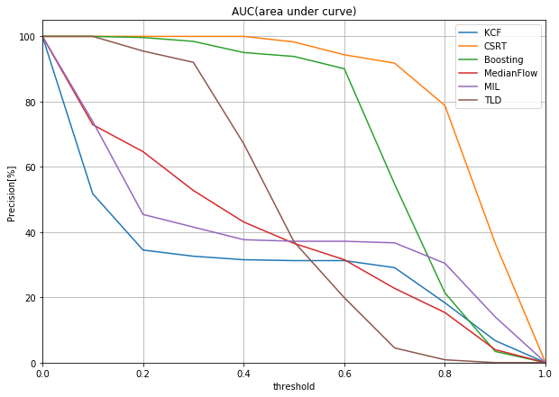
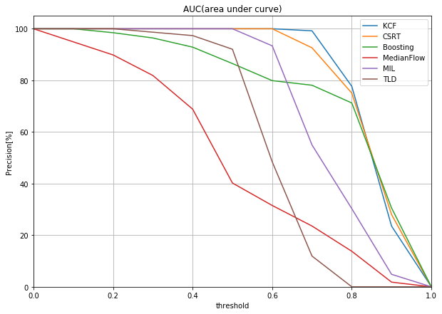
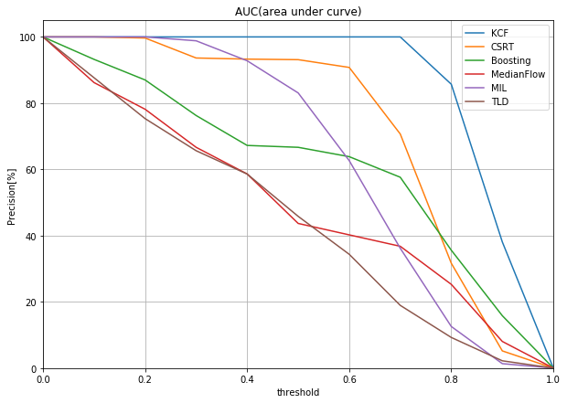

# Object Tracking using OpenCV
### 参考：[OpenCV Object Tracking](https://www.pyimagesearch.com/2018/07/30/opencv-object-tracking/)
### データセット：[Visual Tracker Venchmark](http://cvlab.hanyang.ac.kr/tracker_benchmark/datasets.html)
### 評価方法：[yoyoyo-yo/Gasyori100knock(https://github.com/yoyoyo-yo/Gasyori100knock/tree/master/Question_91_100)

# Tracker
### -CSRT
### -KCF
### -Boosting
### -Median Flow
### -TLD
### -MIL

# Result
### BlueCar
 
### Bolt
 
### CarDark
 
### Woman
 